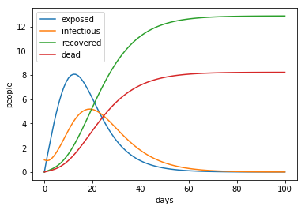

# System Dynamics: Ebola outbreak in Nigeria 2014

Ordinary differential equations (ODEs) are an invaluable tool for modelling and analysis of complex systems. 
In system dynamics terminology ODEs model stocks and flows. 
Unfortunately, their handling is not trivial and outside of academia it is not commonly used. 
However, with just a few lines of code it is possible to plot the functions which allow straightforward interpretation of the interdependencies.
<a href="http://dx.doi.org/10.1016/j.epidem.2015.03.001">Althaus et al. (2015)</a> estimated coefficients for a set of differential equations modelling the Ebola outbreak in Nigeria 2014. 
Based on the information in this paper the outbreak has been modelled using *Python* and *R*.

Comparing the proposed model with one having a constant transmission rate points out the tremendous importance of rapid implementation of control measures in order to reduce the spread of the disease.

Reference:  
Althaus C.L., Low N, Musa E.O., Shuaib F., Gsteiger S. (2015). Ebola virus disease outbreak in Nigeria: transmission dynamics and rapid control. Epidemics 11(0): 80–84
